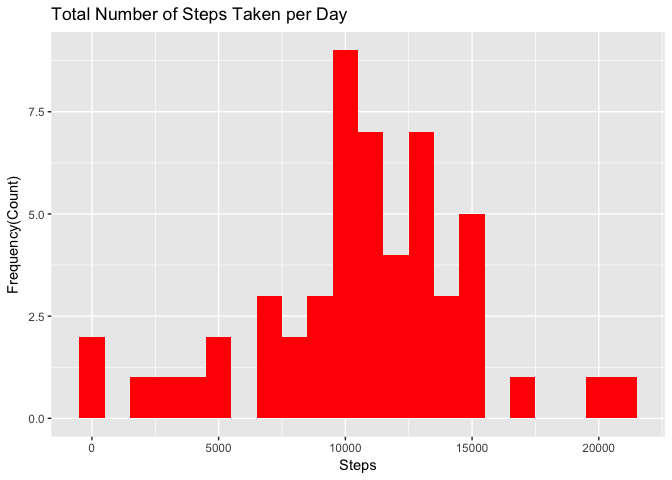
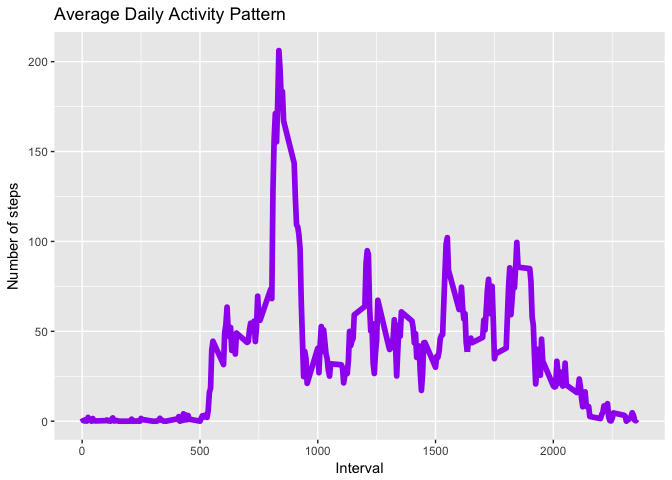
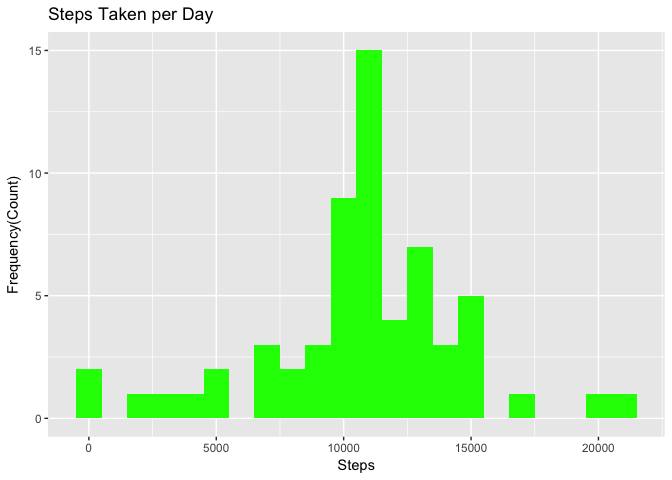
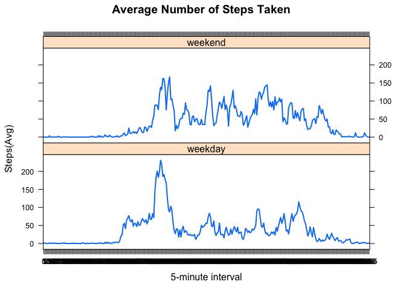

# PA_template

# Reproducible Research: Peer Assessment 1
#Aparajita Bhandari
# August 2017
## Prepare the R environment

Throughout this report when writing code chunks in the R markdown document, **always use echo = TRUE** so that someone else will be able to read the code. 


```r
library(knitr)
opts_chunk$set(echo = TRUE, results = 'hold')
```
### Load required libraries

```r
library(data.table)
library(ggplot2) 
library(lattice)
```
## Loading and preprocessing the data

```r
activitydata <- read.csv('activity.csv', header = TRUE, sep = ",",
                  colClasses=c("numeric", "character", "numeric"))

activitydata$date <- as.Date(activitydata$date, format = "%Y-%m-%d")
activitydata$interval <- as.factor(activitydata$interval)

str(activitydata) ##check data
```

```
## 'data.frame':	17568 obs. of  3 variables:
##  $ steps   : num  NA NA NA NA NA NA NA NA NA NA ...
##  $ date    : Date, format: "2012-10-01" "2012-10-01" ...
##  $ interval: Factor w/ 288 levels "0","5","10","15",..: 1 2 3 4 5 6 7 8 9 10 ...
```

## What is mean total number of steps taken per day?

Now here we ignore the missing values


```r
total_steps <- aggregate(steps ~ date, activitydata, sum)
colnames(total_steps) <- c("date","steps")
head(total_steps)
```

```
##         date steps
## 1 2012-10-02   126
## 2 2012-10-03 11352
## 3 2012-10-04 12116
## 4 2012-10-05 13294
## 5 2012-10-06 15420
## 6 2012-10-07 11015
```
1. Now we make a histogram of the total number of steps taken per day, plotted with appropriate bin interval.


```r
ggplot(total_steps, aes(x = steps)) + 
  geom_histogram(fill = "red", binwidth = 1000) + 
  labs(title="Total Number of Steps Taken per Day", 
       x = "Steps", y = "Frequency(Count)")
```

<!-- -->

2. calculate the ***mean*** and ***median*** of the number of steps taken per day.


```r
mean(total_steps$steps)
median(total_steps$steps)
```

```
## [1] 10766.19
## [1] 10765
```

## What is the average daily activity pattern?

```r
steps_per_interval <- aggregate(activitydata$steps, by = list(interval = activitydata$interval),FUN=mean, na.rm=TRUE)
steps_per_interval$interval <- 
  as.integer(levels(steps_per_interval$interval)[steps_per_interval$interval])
colnames(steps_per_interval) <- c("intervals", "steps")
```

1.Plot with the time series of the average number of steps taken versus the 5-minute intervals:

```r
ggplot(steps_per_interval, aes(x=intervals, y=steps)) +   
  geom_line(color="purple", size=2) +  
  labs(title="Average Daily Activity Pattern", x="Interval", y="Number of steps") 
```

<!-- -->

2. Now, we find the 5-minute interval with the containing the maximum number of steps:


```r
max_interval <- steps_per_interval[which.max(steps_per_interval$steps),]
```

## Imputing missing values:

## 1. Total number of missing values:

The total number of missing values in steps can be calculated using `is.na()` method to check whether the value is mising or not and then summing the logical vector.


```r
sum(is.na(activitydata))
```

```
## [1] 2304
```


## 2. Fill in the missing values in the dataset with the mean 


```r
missing_vals <- activitydata # new dataset 
for (i in steps_per_interval$interval) {
  missing_vals[missing_vals$interval == i & is.na(missing_vals$steps), ]$steps <- 
    steps_per_interval$steps[steps_per_interval$interval == i]
}
```
Check if there are any missing values remaining 


```r
head(missing_vals) # no NAs
sum(is.na(missing_vals))
```

```
##       steps       date interval
## 1 1.7169811 2012-10-01        0
## 2 0.3396226 2012-10-01        5
## 3 0.1320755 2012-10-01       10
## 4 0.1509434 2012-10-01       15
## 5 0.0754717 2012-10-01       20
## 6 2.0943396 2012-10-01       25
## [1] 0
```
Zero output shows that there are ***NO MISSING VALUES***

### 3. A histogram of the total number of steps taken each day

Plot of a histogram of the daily total number of steps taken, plotted with a bin interval of 1000 steps, after filling missing values.


```r
filled_steps_per_day <- aggregate(steps ~ date, data = missing_vals, sum)
colnames(filled_steps_per_day) <- c("date","steps")

##plotting the histogram
ggplot(filled_steps_per_day, aes(x = steps)) + 
  geom_histogram(fill = "green", binwidth = 1000) + 
  labs(title="Steps Taken per Day", 
       x = "Steps", y = "Frequency(Count)")
```

<!-- -->


### Calculate and report the **mean** and **median** total number of steps taken per day


```r
steps_mean_fill   <- mean(filled_steps_per_day$steps)
steps_median_fill <- median(filled_steps_per_day$steps)
```
The mean is **10766.189** and median is **10766.189**.

### Do these values differ from the estimates from the first part of the assignment?
Yes, these values do differ slightly.

### What is the impact of imputing missing data on the estimates of the total daily number of steps?
While the mean value remains unchanged, the median value has shifted and virtual matches to the mean

## Are there differences in activity patterns between weekdays and weekends?

```r
missing_vals$day <- weekdays(missing_vals$date)
missing_vals$week <- ""
missing_vals[missing_vals$day == "Saturday" | missing_vals$day == "Sunday", ]$week <- "weekend"
missing_vals[!(missing_vals$day == "Saturday" | missing_vals$day == "Sunday"), ]$week <- "weekday"
missing_vals$week <- factor(missing_vals$week)
```

Below you can see the panel plot comparing the average number of steps taken per 5-minute interval across weekdays and weekends:

```r
avg_step <- aggregate(steps ~ interval + week, data = missing_vals, mean)
xyplot(steps ~ interval | week, data = avg_step, type = "l", lwd = 2,
       layout = c(1, 2), 
       xlab = "5-minute interval", 
       ylab = "Steps(Avg)",
       main = "Average Number of Steps Taken ")
```

<!-- -->

